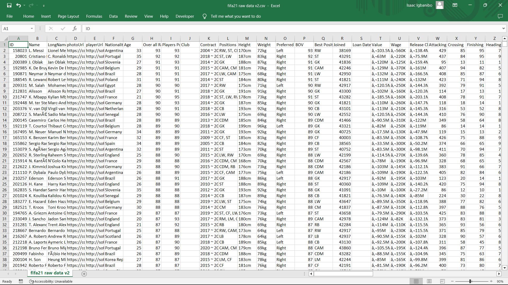

# FIFA-dataset-cleaning

**A data cleaning done on Excel!** 

Finding a column to clean or identifying a dirty data is the first and a trickish step.

Extracting the data from the csv file to excel was the first step.  
This is the how the raw data presents itself.

After uploading it on Google Sheet. Here is the outcome

.png)

This took care of all unwanted characters in most cells espaecially those on the names.

the file was saved to an excel format and reopened in the excel sheet.

A tilde (~) was replaced with a hyphen (-) using the Substitute function. 

The height column contained its unit (cm) at the end of the value in same column. Firstly, the figure was extracted from the cell using the LEFT function and the unit removed. The height was Converted from cm to Ft. 
The weight column was converted from kg to lbs and without the unit at the end of the figure.

Players’ Injury rating which was in a text format was converted to a number format using the ‘Text to columns’ function.
Star symbols attached to the end of the figure was taken off using the LEFT function.
This was also applied to the players’ skill moves rating column as well as the Players’ weak foot rating column.

All these were major obstacles and were of different levels of difficulty but while working on the Players’ worth column, I met a different type of difficulty.

This particular column is all about the players worth and it had its own peculiarity in terms of being unclean.

Its figures were in Euros, the figures were written in short form, and they all had a ‘M’ or ‘K’ which represents its unit, for example, ‘€103.3M’ or ‘€905K’.

I think these are supposed to be written properly and in full, so I began working them and these were the steps I used that worked for me;
Firstly, I created a different column that took away the ‘€’ from the figures using the ‘MID’ function. Using the example above, I was left with ‘103.2M’ and ‘905K’
Secondly, I created another column to take care of the ‘M’ and ‘K’ in the column. I had to use a very complicated and combination of different functions to achieve what I want. The function used was ‘IFNA(LEFT(U2,LEN(U2)-1)*CHOOSE(MATCH(RIGHT(U2,1),{"K","M"},0),1000,1000000),U2)’
Thirdly, after realizing this was what I wanted, I converted the figures to dollars by multiplying it with the current exchange.

In total hits made by each player, some players made over a thousand hits and they were indicated with a ‘K’, for example, there were figures like ‘1.6k’ total hits. This was sorted using the ‘substitute’ function. 

